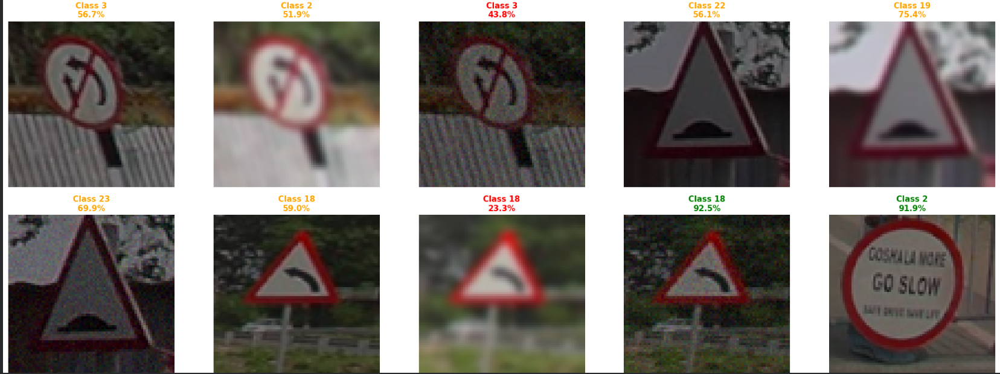

# 🚦 Domain Adaptation for Traffic Sign Recognition

### **Why German AI Can't Drive on Indian Roads**

## 📋 Project Overview
This project explores the **Domain Shift** problem in Computer Vision. While standard Convolutional Neural Networks (CNNs) achieve high accuracy (96%+) on standardized datasets like GTSRB (German Traffic Sign Recognition Benchmark), they frequently fail when deployed in non-standard environments.

**The Goal:** Adapt a MobileNetV2 architecture to recognize traffic signs under adverse conditions specific to Indian roads (faded paint, motion blur, low light, and non-standard text variations).

## 🛠️ Tech Stack
* **Core:** Python, TensorFlow/Keras, OpenCV
* **Architecture:** MobileNetV2 (Transfer Learning)
* **Techniques:** Data Augmentation, Synthetic Noise Generation ("Digital Darkroom"), Fine-Tuning.

## 📊 Key Experiments & Results

| Experiment | Accuracy | Observation |
| :--- | :--- | :--- |
| **Baseline (CNN from scratch)** | 96.7% | High accuracy on German test data. Failed completely on real-world images (Stopped at "Motion Blur"). |
| **Transfer Learning (MobileNet)** | 84.2% | Lower theoretical accuracy, but significantly higher **robustness** on real-world noisy data. |
| **Field Test (Indian Roads)** | **N/A** | Successfully identified standard symbols (e.g., "Bumpy Road") in low light. |
| **Failure Analysis** | **Critical** | Model failed on "Go Slow" signs. **Root Cause:** European datasets use symbols; Indian signs use English text. |

## 🧪 The "Digital Darkroom"
To stress-test the model without risking a real car, I built a pipeline to generate **Hard Negative** samples.
* **Input:** 13 Real-world field images.
* **Process:** Applied random Gaussian Noise, Motion Blur (kernel size 5-9), and Brightness Reduction (30-70%).
* **Output:** 39 "Nightmare" scenarios to validate model reliability.

## 🧠 Lessons Learned
* **Resolution Matters:** Increasing input size from 32x32 to 75x75 was critical for MobileNet feature extraction.
* **The Domain Gap:** Transfer learning is not a magic wand. Regional differences (Text vs. Symbols) require locally curated datasets.

## 👤 Author
**[Abhirup Chattopadhyay]**
*Electrical Engineering Student, Jalpaiguri Government Engineering College*
